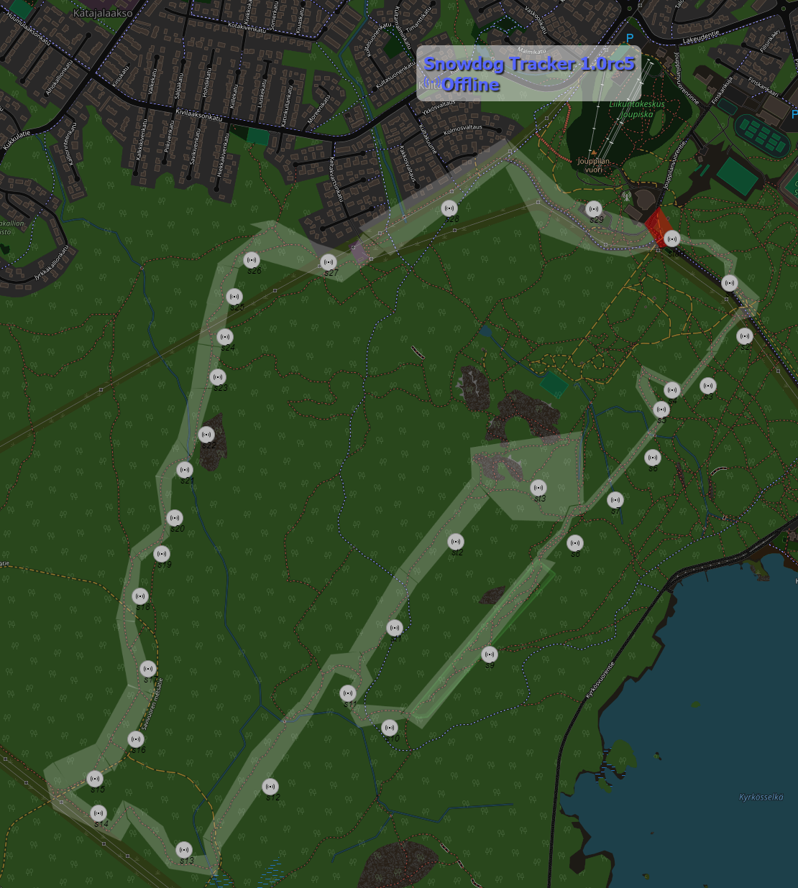

# Snowdog Geospatial Data Collection System

The **Snowdog Geospatial Data Collection System** is a sophisticated solution designed for mountainbikers to track the condition of the winter trail driven by the Snowdog. Utilizing the Snowdog device, this system integrates various technologies to provide up-to-date trail information, ensuring a seamless user experience.

## Problem Statement

One common challenge faced by outdoor enthusiasts is the lack of real-time information on trail conditions. The initial solution involved integrating with Strava; however, this posed accessibility issues for users without Strava accounts and hindered the embedding of maps on external websites.

## Project Planning

The development approach followed an Agile and Lean methodology, allowing for swift prototyping, testing, and refinement. The project progressed from the initial concept to a functional prototype within a matter of days.

## Devices Used

The system relies on the ECM2040, a commercial product offered by [Exertus.fi](http://www.exertus.fi). This module provides comprehensive connectivity, enabling the collection of positional data, which is then seamlessly transmitted to the cloud.

## Architecture Overview

The system adopts a Producer-Consumer model on the edge side, incorporating a streamlined flow of data. A PHP backend is employed to store data in a MySQL database, providing a reliable and familiar infrastructure. A Python script processes NMEA data, placing it into a queue, and leveraging Redis streams for efficient data flow. Finally, consumer groups retrieve and push the information to various destinations, including the utilization of [IoT-Ticket.com](http://iot-ticket.com) for comprehensive visualization.


## Technical Specifications

The core functionality is implemented through a Python script responsible for processing NMEA data. This data is strategically placed in Redis streams, facilitating a robust flow for subsequent processing by consumer groups. The resulting information is then seamlessly pushed to different locations, including the integration with IoT-Ticket.com for an immersive and dynamic map visualization.

## Leafletjs Integration

A one-page map, powered by Leafletjs, is utilized to present a heatmap of the route. Geofences are intelligently formed using [Geofence.io](http://www.geofence.io), and the edge software calculates the device's current location within these defined areas.

# Conclusion

The Snowdog Geospatial Data Collection System stands as a comprehensive solution for users seeking to collect and visualize geospatial data using geofences. This system seamlessly integrates cutting-edge technologies, providing a reliable and user-friendly experience for mountainbikers for observing winter trail condition.

# Running the service
1. `make all`
2. `docker-compose up -d --build`
3. go to address http://localhost/snowdog/

## Running tests
```
docker run --network=snowdog_mynetwork -it --rm -v $(pwd):/tests snowdog-rpa-snowdog bash -c "robot --outputdir /tests/results /tests"
```

# Map of the dog


# License
```
Copyright (c) <2023> <Juha Viitanen(https://github.com/bittikettu) & Matti Wenell(https://github.com/Mattti0)>

Permission is hereby granted, free of charge, to any person obtaining a copy
of this software and associated documentation files (the "Software"), to deal
in the Software without restriction, including without limitation the rights
to use, copy, modify, merge, publish, distribute, sublicense, and/or sell
copies of the Software, and to permit persons to whom the Software is
furnished to do so, subject to the following conditions:

The above copyright notice and this permission notice shall be included in all
copies or substantial portions of the Software.

THE SOFTWARE IS PROVIDED "AS IS", WITHOUT WARRANTY OF ANY KIND, EXPRESS OR
IMPLIED, INCLUDING BUT NOT LIMITED TO THE WARRANTIES OF MERCHANTABILITY,
FITNESS FOR A PARTICULAR PURPOSE AND NONINFRINGEMENT. IN NO EVENT SHALL THE
AUTHORS OR COPYRIGHT HOLDERS BE LIABLE FOR ANY CLAIM, DAMAGES OR OTHER
LIABILITY, WHETHER IN AN ACTION OF CONTRACT, TORT OR OTHERWISE, ARISING FROM,
OUT OF OR IN CONNECTION WITH THE SOFTWARE OR THE USE OR OTHER DEALINGS IN THE
SOFTWARE.
```
