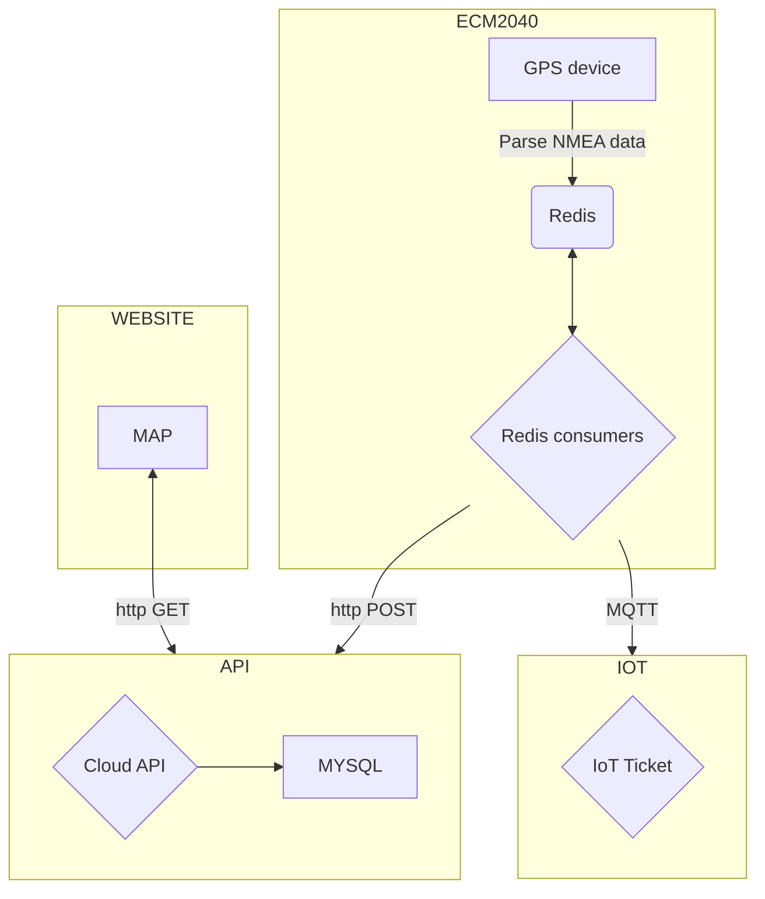
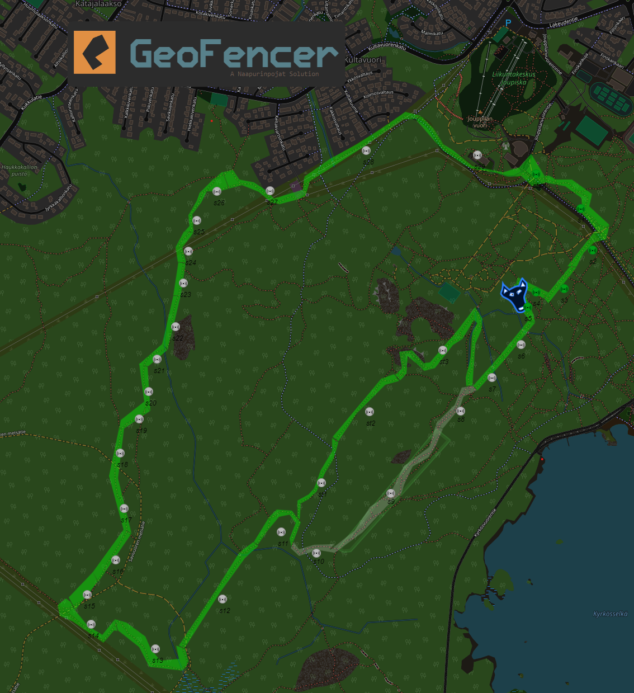

<p align="center">
<br><br>
<a title="Code Size" target="_blank" href="https://github.com/bittikettu/snowdog"></a>

<a title="GitHub Pull Requests" target="_blank" href="https://github.com/bittikettu/snowdog/pulls"></a>

<a title="Last Commit" target="_blank" href="https://github.com/bittikettu/snowdog/commits/master"></a>
<a title="Hits" target="_blank" href="https://github.com/bittikettu/snowdog"></a>
</p>


# Snowdog Geospatial Data Collection System

The **Snowdog Geospatial Data Collection System** is a sophisticated solution designed for mountainbikers to track the condition of the winter trail driven by the Snowdog. Utilizing the Snowdog device, this system integrates various technologies to provide up-to-date trail information, ensuring a seamless user experience.

## Problem Statement

One common challenge faced by outdoor enthusiasts is the lack of real-time information on trail conditions. The initial solution involved integrating with Strava; however, this posed accessibility issues for users without Strava accounts and hindered the embedding of maps on external websites.

## Project Planning

The development approach followed an Agile and Lean methodology, allowing for swift prototyping, testing, and refinement. The project progressed from the initial concept to a functional prototype within a matter of days.

## Devices Used

The system relies on the ECM2040, a commercial product offered by [Exertus.fi](http://www.exertus.fi). This module provides comprehensive connectivity, enabling the collection of positional data, which is then seamlessly transmitted to the cloud.

## Architecture Overview

The system adopts a Producer-Consumer model on the edge side, incorporating a streamlined flow of data. A PHP backend is employed to store data in a MySQL database, providing a reliable and familiar infrastructure. A Python script processes NMEA data, placing it into a queue, and leveraging Redis streams for efficient data flow. Finally, consumer groups retrieve and push the information to various destinations, including the utilization of [IoT-Ticket.com](http://iot-ticket.com) for comprehensive visualization.



## Technical Specifications

The core functionality is implemented through a Python script responsible for processing NMEA data. This data is strategically placed in Redis streams, facilitating a robust flow for subsequent processing by consumer groups. The resulting information is then seamlessly pushed to different locations, including the integration with IoT-Ticket.com for an immersive and dynamic map visualization.

## Leafletjs Integration

A one-page map, powered by Leafletjs, is utilized to present a heatmap of the route. Geofences are intelligently formed using [geojson.io](https://geojson.io/), and the edge software calculates the device's current location within these defined areas.

# Conclusion

The Snowdog Geospatial Data Collection System stands as a comprehensive solution for users seeking to collect and visualize geospatial data using geofences. This system seamlessly integrates cutting-edge technologies, providing a reliable and user-friendly experience for mountainbikers for observing winter trail condition.

# Running the service
1. `make all`
2. `docker-compose up -d --build`
3. go to address http://localhost/snowdog/

## Running tests
```
docker run --network=snowdog_mynetwork -it --rm -v $(pwd):/tests snowdog-rpa-snowdog bash -c "robot --outputdir /tests/results /tests"
```

# Map of the dog

